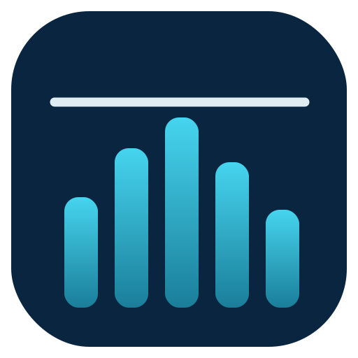

<div align="center">



# Tidemark

**A lightweight, always-on-top realtime network throughput monitor for Windows.**

Tidemark polls an SNMP host once per second and plots live upload/download
throughput on a smooth, scrolling graph — one compact window per device.

[](../../actions/workflows/build.yml)
[](../../actions/workflows/release.yml)
[](../../releases/latest)


</div>

---

## ✨ Features

- **Live throughput graph** — up/download rates sampled every second on a scrolling chart.
- **Multiple hosts** — monitor several interfaces in one window, or run separate instances side by side.
- **Tiny & frameless** — a borderless window that remembers its size and position.
- **Dark & light themes** — toggle from the right-click context menu.
- **At-a-glance stats** — current, max and average rate per host.
- **Self-contained** — a single `tidemark.exe`, no installer, no runtime, no dependencies.

## 🚀 Quick start

### 1. Download

Grab the latest `tidemark-windows-amd64.zip` from the
[**Releases**](../../releases/latest) page and unzip it anywhere. You'll get:

```
tidemark.exe          # the application
example-config.json   # a template you can copy and edit
README.md
```

### 2. Create a config file

Tidemark is launched with a JSON config that tells it which host(s) to poll.
Copy the template and edit it:

```powershell
Copy-Item example-config.json my-router.json
notepad my-router.json
```

A minimal config only needs a host and an SNMP community string:

```json
{
  "hosts": [
    {
      "host": "192.168.1.1",
      "name": "Main Router",
      "community": "public",
      "downloadOID": "1.3.6.1.2.1.31.1.1.1.6.1",
      "uploadOID":   "1.3.6.1.2.1.31.1.1.1.10.1"
    }
  ]
}
```

> 💡 **Finding the right OIDs.** The defaults read the 64-bit `ifHCInOctets` /
> `ifHCOutOctets` counters for interface index **1**. The trailing `.1` is the
> interface index — change it (`.2`, `.3`, …) to monitor a different port. Use a
> tool like `snmpwalk` to discover which index maps to which interface on your device.

### 3. Run it

Pass the config file as the only argument:

```powershell
.\tidemark.exe my-router.json
```

The window opens immediately and starts plotting. **Right-click** anywhere in the
window for the context menu (settings, theme toggle, exit). **Drag** the window to
move it — its position and size are saved back into the config file on exit.

### Monitoring several devices

You can list multiple interfaces in the `hosts` array of a single config, **or**
launch one instance per device with its own config file — handy for keeping each
graph in its own window:

```powershell
.\tidemark.exe router.json
.\tidemark.exe switch.json
.\tidemark.exe nas.json
```

## ⚙️ Configuration reference

The config file is a top-level object with optional window/theme settings plus a
`hosts` array. (A bare single-host object is also accepted for backwards compatibility.)

### Top-level options

| Field            | Type    | Default | Description                                      |
|------------------|---------|---------|--------------------------------------------------|
| `hosts`          | array   | —       | List of hosts to monitor (see below).            |
| `darkTheme`      | bool    | `true`  | Use the dark color scheme.                       |
| `windowWidthDp`  | number  | `1000`  | Window width (device-independent pixels).        |
| `windowHeightDp` | number  | auto    | Window height. Auto-sized to the number of hosts.|
| `windowX`        | number  | OS      | Saved top-left X position (physical pixels).     |
| `windowY`        | number  | OS      | Saved top-left Y position (physical pixels).     |

> Window geometry and theme are written back automatically when you move, resize,
> or close the window — you normally never set these by hand.

### Per-host options

| Field         | Type   | Required | Default                          | Description                                  |
|---------------|--------|----------|----------------------------------|----------------------------------------------|
| `host`        | string | ✅       | —                                | IP address or hostname of the SNMP device.   |
| `community`   | string | ✅       | —                                | SNMP community string.                        |
| `name`        | string |          | (the host address)               | Friendly label shown on the graph.           |
| `port`        | number |          | `161`                            | SNMP UDP port.                               |
| `snmpVersion` | string |          | `"2c"`                           | SNMP version (`1` or `2c`).                  |
| `downloadOID` | string |          | `1.3.6.1.2.1.31.1.1.1.6.1`       | OID for the inbound (download) byte counter. |
| `uploadOID`   | string |          | `1.3.6.1.2.1.31.1.1.1.10.1`      | OID for the outbound (upload) byte counter.  |
| `timeoutMs`   | number |          | `3000`                           | Per-poll SNMP timeout in milliseconds.       |
| `retries`     | number |          | `1`                              | SNMP retry count per poll.                   |

## 🛠️ Building from source

Tidemark is a [Go](https://go.dev) project that builds with [Mage](https://magefile.org).

**Prerequisites:** Go 1.26+ and the build tools (one-off install):

```powershell
go install github.com/josephspurrier/goversioninfo/cmd/goversioninfo@latest
go install github.com/magefile/mage@latest
```

**Build targets** (run `mage -l` to list them):

| Command         | Output                                                        |
|-----------------|---------------------------------------------------------------|
| `mage` / `mage release` | Optimized, windowless `tidemark.exe` (production build).|
| `mage debug`    | Unoptimized build with a console attached for log output.     |
| `mage mac`      | macOS `Tidemark.app` bundle (run on macOS; see below).        |
| `mage generate` | Regenerate the embedded icon + version resource only.         |
| `mage clean`    | Remove build artifacts.                                       |

```powershell
mage release
.\tidemark.exe example-config.json
```

### macOS

`mage mac` produces a `Tidemark.app` bundle (Apple Silicon). It must be built
**on macOS** with the Xcode command-line tools (`xcode-select --install`) because
the native window behaviors use cgo/Cocoa, plus [librsvg](https://wiki.gnome.org/Projects/LibRsvg)
for icon generation (`brew install librsvg`). The app icon is rasterized from
`assets/tidemark.svg` into a `.icns` automatically (`mage icns`). Like the Windows
build, Tidemark needs a config-file argument, so launch it explicitly:

```sh
brew install librsvg
mage mac
./Tidemark.app/Contents/MacOS/tidemark my-router.json
```

The bundle is **unsigned**, so the first launch needs a right-click → Open (or
`xattr -dr com.apple.quarantine Tidemark.app`) to get past Gatekeeper.

## 🖥️ Platform support

| Behavior                              | Windows | macOS | Linux |
|---------------------------------------|:-------:|:-----:|:-----:|
| Live graph, stats, SNMP polling, themes | ✅ | ✅ | ✅ |
| Frameless window + drag to move        | ✅ | ✅ | ✅¹ |
| Right-click context menu in drag area  | ✅ | ✅² | ❌ |
| Save / restore window size             | ✅ | ✅ | ✅ |
| Save / restore window position         | ✅ | ✅³ | ❌⁴ |
| Theme-toggle 💡 glyph                  | ✅ | ⚠️⁵ | ⚠️⁵ |

1. Linux/X11 supports it; on Wayland it depends on the compositor.
2. Implemented via a local `NSEvent` monitor (`platform_darwin.go`); right-click
   anywhere in the window opens the menu (Windows opens it only over drag areas).
3. Persisted in screen pixels relative to the **primary** screen; on multi-monitor
   layouts a window on a secondary display may be restored to a slightly different
   spot.
4. Wayland does not let applications query or set their own window position, so
   this is a no-op there. (X11 could support it but is not implemented.)
5. The 💡 (U+1F4A1) glyph only ships in color-emoji fonts on macOS/Linux, which
   Gio cannot rasterize reliably, so it may show as a box. The button still works.

## 📦 Releases

Pushing to the default branch automatically builds a release binary, tags the
commit, and publishes a GitHub Release with `tidemark-windows-amd64.zip` attached.
See [`.github/workflows/release.yml`](.github/workflows/release.yml).

## 📄 License

See the repository for license details.
